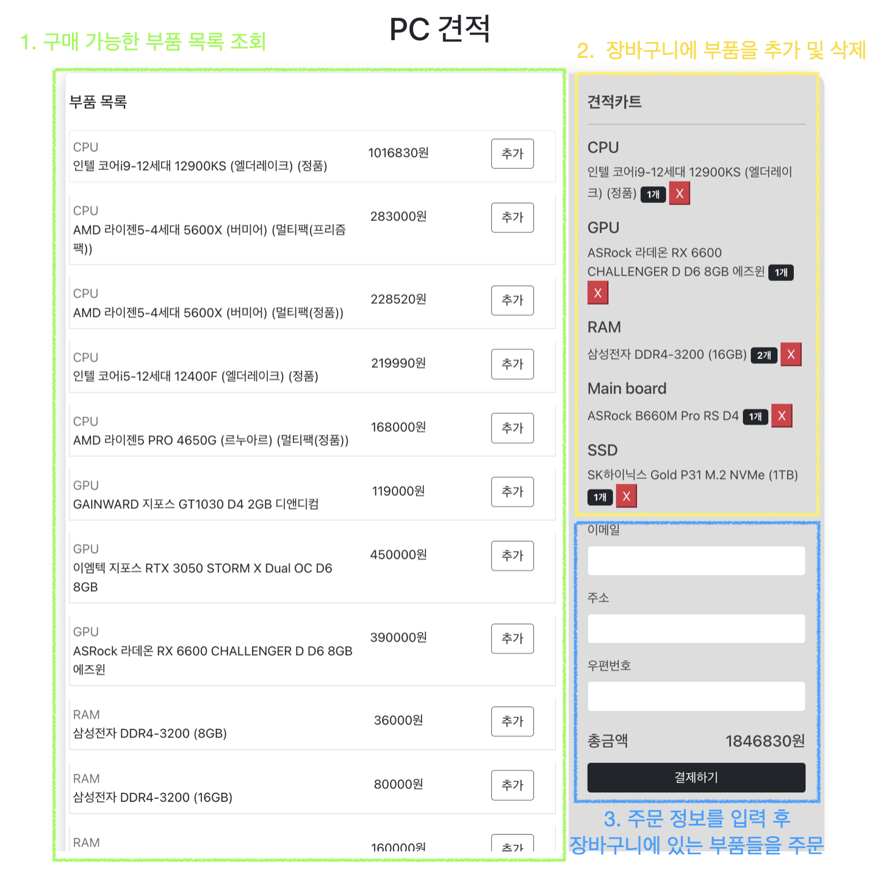

# springboot 상품관리 REST API 프로젝트

## 프로젝트 목표

프로그래머스 백엔드 데브코스 클론 코딩 프로젝트 내용을 바탕으로 컴퓨터 견적 및 주문 API를 개발한다.

## 사용 기술
- Backend : Springboot 2.6.7, MySQL 8, Gradle
- Frontend : React
- Tool : Intellij, Postman

## 기능
### 사용자
- 구입할 수 있는 컴퓨터 부품 목록을 조회할 수 있다.
- 구입 가능한 부품들을 장바구니에 넣어 주문을 할 수 있다.

### 관리자
- 주문 목록을 조회할 수 있다.
- 사용자가 구매할 수 있는 컴퓨터 부품을 추가할 수 있다.

### 웹 페이지 화면


## API 요청 및 응답

### 주문 조회 API
```
GET localhost:8080/api/v1/orders
```
|필드명|내용|
|------|---|
|orderId|주문 ID|
|email|주문 고객의 email|
|address|주문 고객의 배송지 정보|
|orderStatus|주문의 현재 상태<br>- PAYMENT_COMPLETED : 결제 완료<br>- READY_FOR_DELIVERY : 배송 준비중<br>- SHIPPED : 배송중<br>- DELIVERY_COMPLETED : 배송 완료<br>- CANCELED : 주문 취소|
|parts|해당 주문에 포함된 부품들의 수량 및 가격 정보|
|createdAt|주문 생성 일시|

JSON 응답 본문 예
```json
[
    {
        "orderId": 8,
        "email": "aa@aaa.com",
        "address": {
            "address": "서울특별시",
            "zipcode": "123123"
        },
        "orderStatus": "PAYMENT_COMPLETED",
        "parts": [
            {
                "orderPartId": 3,
                "partId": 4,
                "orderId": 8,
                "price": 439980,
                "quantity": 2,
                "createdAt": "2022-05-04T21:17:46"
            },
            {
                "orderPartId": 4,
                "partId": 2,
                "orderId": 8,
                "price": 283000,
                "quantity": 1,
                "createdAt": "2022-05-04T21:17:46"
            }
        ],
        "createdAt": "2022-05-04T21:17:46"
    },
    ...
]
```

### 주문 API
```
POST localhost:8080/api/v1/orders
```

|필드명|내용|조건|
|------|---|---|
|email|주문 고객의 email|Null이거나 비어있으면 안되며, 이메일 형식이어야 한다|
|address|배송지 주소|Null이거나 비어있으면 안된다|
|zipcode|배송지의 우편번호|Null이거나 비어있으면 안된다|
|orderParts| 주문에 포함된 주문 가격 및 수량을 포함한 부품들의  정보|Size가 0보다 커야한다.|

#### JSON 요청 본문 예
```json
{
    "email": "hello@gmail.com",
    "address": "서울 특별시",
    "zipcode": "123123",
    "orderParts": [
        {
            "partId": 1,
            "category": "CPU",
            "price": 400000,
            "quantity": 2
        },
        ...
    ]
}
```

응답 본문 예
- 생성된 주문의 ID 값을 반환한다.
```
15
```

### 부품 조회 API
카테고리 별로 부품을 조회할 수 있습니다.
```
GET localhost:8080/api/v1/parts?category=NONE
```
category를 통해 다음과 값들 중 하나를 전달할 수 있습니다.
- NONE : 전체 부품을 조회한다.
- CPU, GPU, RAM, MAIN_BOARD, SSD

응답 본문의 예
```json
[
    {
        "partId": 1,
        "name": "인텔 코어i9-12세대 12900KS (엘더레이크) (정품)",
        "price": 1016830,
        "category": "CPU"
    },
    {
        "partId": 2,
        "name": "AMD 라이젠5-4세대 5600X (버미어) (멀티팩(프리즘팩))",
        "price": 283000,
        "category": "CPU"
    },
    {
        "partId": 3,
        "name": "AMD 라이젠5-4세대 5600X (버미어) (멀티팩(정품))",
        "price": 228520,
        "category": "CPU"
    },

    ...
```

### 부품 추가 API
```
POST localhost:8080/api/v1/parts
```
|필드명|조건|
|---|---|
|name|Null이거나 빈 문자열이어서는 안된다.|
|price|0이상의 값이어야 한다.|
|category|`CPU, GPU, RAM, MAIN_BOARD, SSD, NONE` 중 하나의 값이어야 한다.|

요청 본문 예
```json
{
    "name": "Intel i5",
    "price": 150000,
    "category": "CPU"
}
```

응답 본문 예
- 저장된 부품의 ID 값
```json
20
```